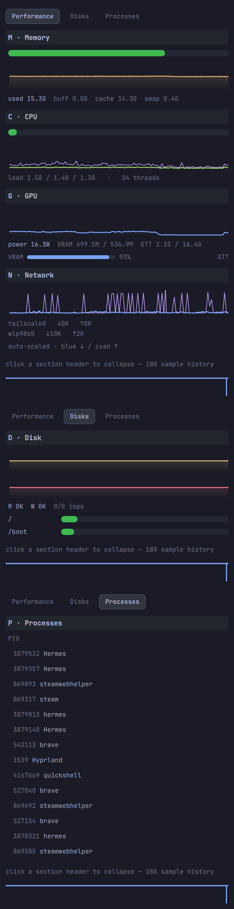

# Omarchy SysMon

Live system stats in the [Omarchy](https://omarchy.org/) bar — a compact letter+meter strip that expands into a tabbed task-manager popup: performance charts, GPU load/VRAM/GTT, per-volume disk gauges, and a killable process table.

```
bar (compact):   ▎M  ▎C  ▎N  ▎D        ← click to open
                 └ hover for values
```



Per tab: [Performance](sysmon-performance.png) · [Disks](sysmon-disks.png) · [Processes](sysmon-processes.png)

Forked from [vm.sysmem](https://github.com/jhonoryza/omarchy-sysmem) by jhonoryza (MIT).

## Bar

Four groups, one letter + one 5px level meter each (numbers live in the hover tooltip and the popup). `barMode: values` in the plugin settings restores the original full readouts (`M 10.5/30.5G  C 12%  N ↓1.2M↑240K  D 44G/930G`).

| Letter | Stat | Bar fill | Source |
|---|---|---|---|
| M | RAM used % | green/amber/red (70/90) | `/proc/meminfo` |
| C | CPU utilization | green/amber/red | `/proc/stat` jiffy deltas |
| N | ↓/↑ rate | blue, log-scale activity (1 Gbit/s ≈ full) | `/sys/class/net/*/statistics` deltas |
| D | whole-disk used % | green/amber/red | `df` + `lsblk` |

Left-click opens the detail popup. Right/middle-click refreshes.

## Popup

A task-manager view anchored under the widget, organized in three tabs — **Performance / Disks / Processes** — each sized to fit without scrolling:

- **Header** — CPU/GPU/NVMe temperatures, threshold-colored.
- **Performance tab**
  - **M · Memory** — master gauge, amber time-series, buffers/cache/swap breakdown.
  - **C · CPU** — master gauge, total % (green) + busiest core (violet) dual-line chart, load averages, thread count.
  - **G · GPU** — blue load line chart, power draw, VRAM and GTT meters (amdgpu sysfs; section hides when no GPU).
  - **N · Network** — down (blue) + up (cyan) auto-scaled dual-line chart, per-interface rates.
- **Disks tab** — read/write rate charts, IOPS, and a fuel gauge per mounted volume (local filesystems, deduped by source device).
- **Processes tab** — top processes by CPU/mem (click the header to switch sort), inline kill: TERM first; if the process survives the next refresh the button becomes **Force kill (9)**. Only your own processes get a kill affordance.

Every clickable — tabs, section headers, sort toggle, kill buttons — takes a pointing-hand cursor and highlights on hover. Section headers collapse on click. While the popup is open the sample cadence tightens to 1 s so the charts run live; history ring buffers (180 samples) are kept whether or not the popup is open, so it opens with ~3–6 minutes of warm history.

VRAM is popup-only on purpose: on the machine this was built on the 512 MB carve-out sits pinned near full, which makes it noise in a bar but useful context in a detail view.

## IPC

```bash
omarchy-shell gdeyoung.sysmon open            # open the popup
omarchy-shell gdeyoung.sysmon close
omarchy-shell gdeyoung.sysmon toggle
omarchy-shell gdeyoung.sysmon tab disk        # perf | disk | procs
omarchy-shell gdeyoung.sysmon refresh         # all instances
omarchy-shell gdeyoung.sysmon status          # JSON: open state, tab, heights, buffer fill, last values
```

## Requirements

- Omarchy 4.x with its Quickshell bar (uses `qs.Commons` / `qs.Ui` and the `BarWidget` base)
- Bash + coreutils (`awk`, `df`) — no other dependencies

## Install

```bash
git clone https://github.com/gdeyoung/omarchy-sysmon.git
cd omarchy-sysmon
./install.sh
omarchy restart shell
```

The installer is idempotent and non-destructive. It installs the widget, enables it, places it in the bar's right section, and — if the `vm.sysmem` widget is present — disables it (SysMon supersedes it).

## Uninstall

```bash
omarchy plugin remove gdeyoung.sysmon
omarchy restart shell
```

## How it works

A `Process` runs `sysmon.sh` every tick; the script prints exactly one JSON line (32 keys: per-core jiffies, load, swap, temps, GPU counters, disk IO, per-interface bytes, mounted volumes) and the widget parses it. Cumulative counters are converted to rates in the widget between ticks — the probe stays stateless (~100 ms per run). While the popup is open a second probe (`procprobe.sh`) feeds the process table. Charts are one `Canvas` sparkline each; no extra processes while idle.

## License

MIT
